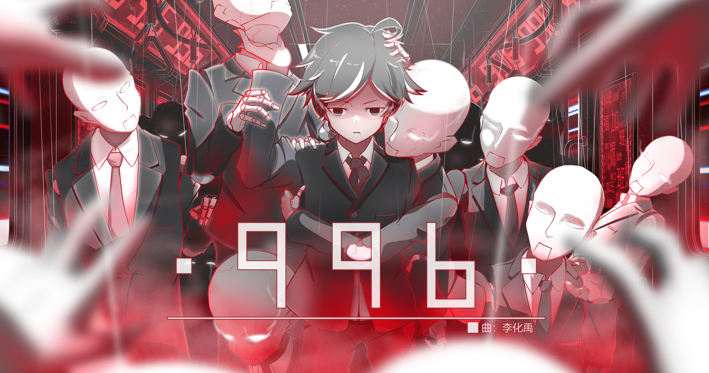

# Phigros帮助文档

---

## Phigros 歌曲信息查询

### 描述

指令:

    /pgr info [曲名/别称]

结果:

> 曲名; 所属章节; BPM; 曲师; 
> 
> 曲绘; 画师;
> 
> 定数; 物量; 谱师;
> 
> tips;

### 示例
    
输入：

    /pgr info 996

结果 (可能不同):

> 曲名：996
> 
> 所属章节：【单曲集】
> 
> 曲师：李化禹
> 
> BPM：140
> 
> 
> 
> 画师：笔记RE
> 
> 定数：3.8(EZ),8.3(HD),14.5(IN)
> 
> 物量：392(EZ),453(HD),996(IN)
> 
> 谱师：RTH(EZ),Likey(HD),Barbarianerman & NerSAN in the ICU(IN)
> 
> tips:"猜猜你要查询多少次才能再看到这条tip￣︶￣"

### 注意事项

- 不要重复进行查询，避免造成因为文段太大而导致的麻烦（刷屏）
- 个别歌曲的别称可能没有收录，请尝试输入歌曲全名或其他关键词进行查询

### 参与

1. 曲名别称

参与增加曲名别称: [链接](https://docs.qq.com/sheet/DR2ZwRXBBbWFDalFn?tab=BB08J2)

2. Tips

参与增加Tips: 联系QQ: 1186848360

---

## Phigros 随机挑战

### 描述

指令:

    /pgr rdm [别称/定数]

结果:

> 随机指定定数的曲目(+难度); 所属章节;
>  
> 简单挑战; 
> 
> 中等挑战; 
> 
> 困难挑战;

### 示例

输入:

     /pgr rdm 15

结果 (可能不同):

> 随机挑战定数为15.6的曲目为：
> 
> Don't Never Around(IN)
> 
> 所属章节为：【KALPA精选集】
> 可选择的附加挑战项目为：
> 
> 简单：『关声音完成曲目并至少取得A评价及以上』
> 
> 中等：『本局游戏中必须FC/AP，否则重开或退出挑战』
> 
> 困难：『闭眼盲打完成曲目并至少取得C评价及以上』

### 注意事项

- 不要重复进行查询，避免造成因为文段太长而导致的麻烦（刷屏）
- 随机挑战完全为伪随机数抽取，没有考虑可不可能实现

### 参与

1. 随机挑战

参与增加随机挑战类型: [链接](https://docs.qq.com/sheet/DRnNPVVNWTGtiU0FB?tab=BB08J2)

---

## Phigros 单曲rks计算器

### 描述

**根据定数查询**
    
指令:
        
    /pgr calc [acc] [定数]

结果:

> 单曲acc; 单曲定数; 单曲rks;

**根据歌曲查询**

指令:
      
    /pgr calc [曲名/别称] [难度(EZ,HD,IN,LE)]

结果:

> 曲名; 单曲acc; 单曲定数(+难度); 单曲rks;

### 示例

**根据定数查询**

输入:

    /pgr calc 99.97 16.8

结果:

> [单曲rks计算]
> 
> acc：99.97
> 
> 定数：16.8
> 
> 单曲rks：16.778

**根据歌曲查询**

输入:

    /pgr rdm 99.97 rrhar'il AT

结果:

> [单曲rks计算]
>
> 歌曲：Rrhar'il
>
> acc：99.97
>
> 定数：16.8（AT）
>
> 单曲rks：16.778

### 注意事项

- 单曲rks计算器仅供计算这一首歌的rks值，具体rks的变动还需按照b19来计算
- acc的值结尾不能是0，比如"99.60"是非法的，应填写"99.6"，在[方法1]中[定数]也是如此
- 在[方法2]中的-[曲名/别称]-可能不能被匹配，如果能写全名可以尽量写全名