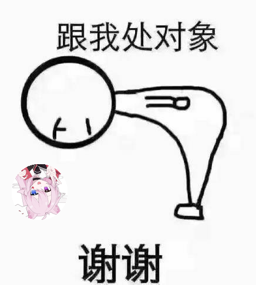

# 娱乐

---

## 图片生成

### 描述

指令:

    /gen <类型> <目标>

<类型>列表:

1. si
2. pa
3. tian
4. chi
5. song
6. run
7. diu
8. xie
9. bxin
10. bishi
11. qian

结果:

> 根据目标生成对应类型的图片

### 示例

输入:

    /gen xie @ятн | 冉亭猫晗

结果 (可能不同):

> 